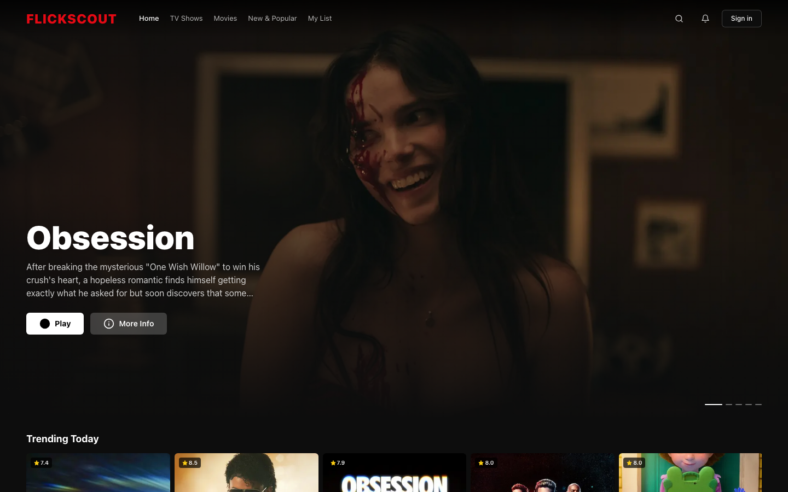
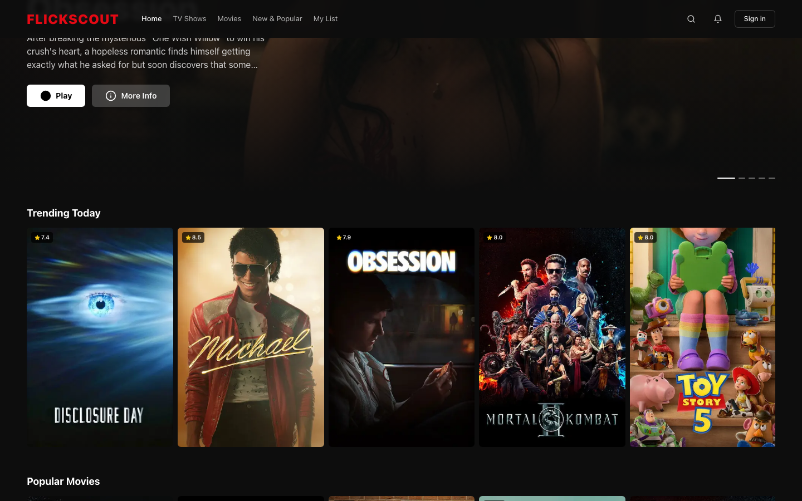
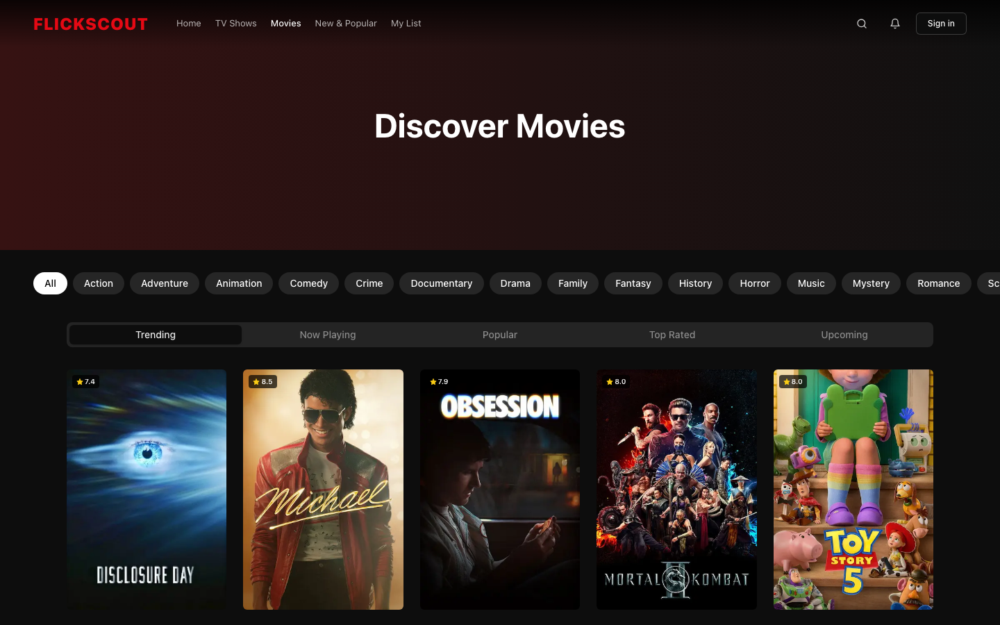
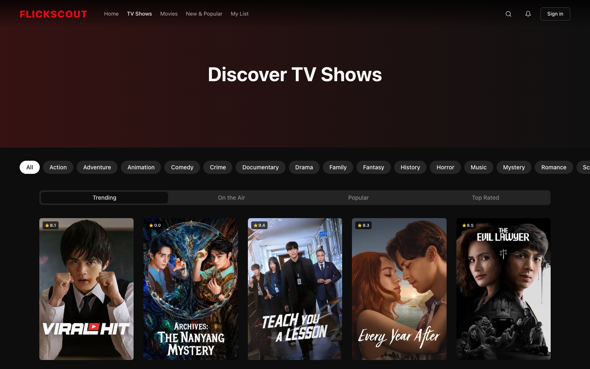
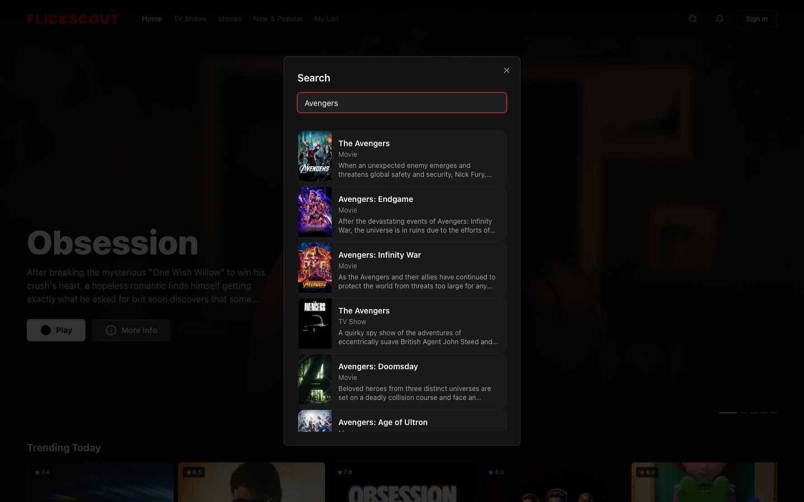
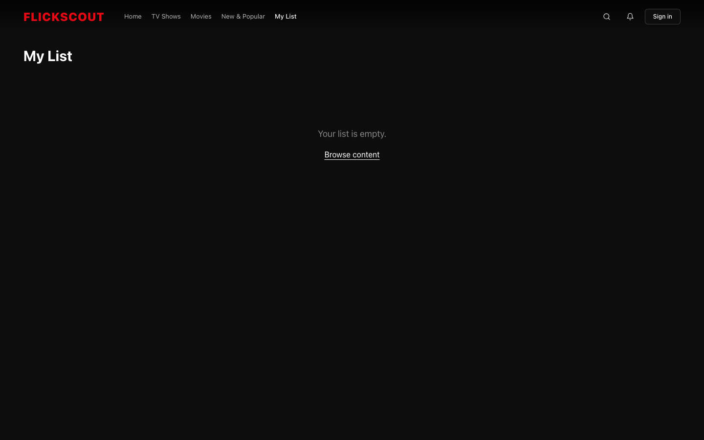

# FlickScout

> Discover, watch, and explore the best of entertainment — movies, TV shows, trailers, and more.

**Live demo:** [flickscout-ritikshah.vercel.app](https://flickscout-ritikshah.vercel.app)



---

## Screenshots

### Home — Hero & Trending Today


### Discover Movies


### Discover TV Shows


### Search


### My List


---

## Features

- **Cinematic dark theme** — full-bleed hero with gradient overlays, `#0d0d0d` background, Netflix-red accent
- **Auto-advancing hero** — cycles through now-playing movies every 8 s with slide dot indicators
- **Hover preview cards** — 600 ms delay, trailer auto-plays (muted), Play / Info / watchlist buttons
- **Horizontal media rows** — smooth CSS scroll with fade-in chevron arrows per section
- **Live search** — debounced, multi-type results (movies, TV, people) with clickable links
- **Genre filter bar** — pill buttons on `/movie` and `/tv` pages using TMDB Discover API
- **Trending Today** — dedicated row on the homepage
- **My List** — localStorage-backed watchlist; `+` button on any card, `/my-list` page to manage
- **Secure API** — TMDB key lives server-side only; all client calls go through `/api/tmdb` proxy

---

## Tech Stack

| Layer | Technology |
|---|---|
| Framework | [Next.js 14](https://nextjs.org) (App Router) |
| Language | TypeScript |
| Styling | Tailwind CSS + shadcn/ui |
| Data | [TMDB API](https://www.themoviedb.org/documentation/api) |
| Animations | Framer Motion |
| Icons | Lucide React |
| Deployment | Vercel |

---

## Getting Started

### 1. Clone & install

```bash
git clone https://github.com/FlickScout/flickscout
cd flickscout
npm install
```

### 2. Set up environment variables

Create a `.env` file in the project root:

```env
TMDB_API_KEY=your_tmdb_api_key_here
TMDB_BASE_URL=https://api.themoviedb.org/3
```

Get a free API key at [themoviedb.org](https://www.themoviedb.org/settings/api).

> **Note:** Use `TMDB_API_KEY` (no `NEXT_PUBLIC_` prefix). The key is kept server-side and never exposed to the browser.

### 3. Run the dev server

```bash
npm run dev
```

Open [http://localhost:3000](http://localhost:3000).

### 4. Build for production

```bash
npm run build
npm start
```

---

## Project Structure

```
src/
├── app/
│   ├── api/tmdb/route.ts      # Server-side TMDB proxy
│   ├── movie/page.tsx          # Movies page with genre filter
│   ├── tv/page.tsx             # TV Shows page with genre filter
│   ├── my-list/page.tsx        # Watchlist page
│   └── page.tsx                # Homepage
├── components/
│   ├── HeroSection.tsx         # Auto-advancing hero carousel
│   ├── MediaGridSection.tsx    # Horizontal scrollable rows
│   ├── media-card.tsx          # Hover preview card with watchlist
│   ├── GenreFilter.tsx         # Genre pill filter bar
│   ├── Navbar.tsx              # Scroll-aware transparent navbar
│   └── search.tsx              # Live search dialog
├── hooks/
│   └── use-watchlist.ts        # localStorage watchlist hook
└── services/
    └── tmdbApi.ts              # TMDB client (server/client aware)
```

---

## Deploy on Vercel

[](https://vercel.com/new)

Set `TMDB_API_KEY` in your Vercel project's environment variables before deploying.

---

## Credits

Built by [Ritik Shah](https://ritikshah.vercel.app). Movie and TV data provided by [TMDB](https://www.themoviedb.org).
